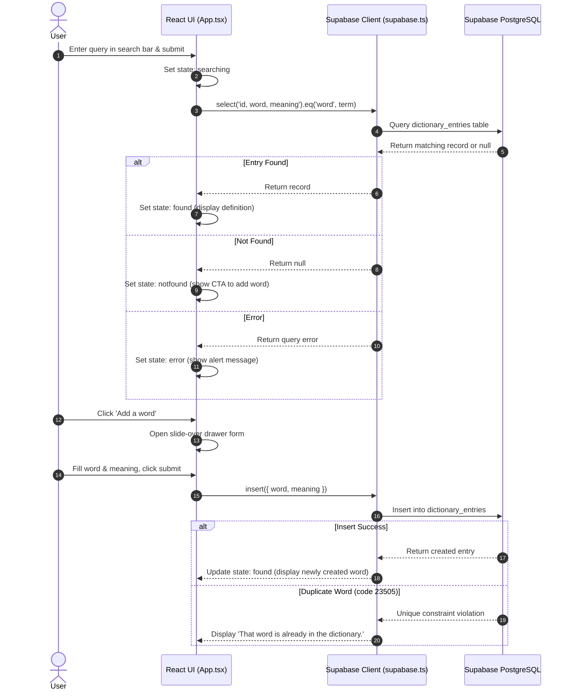

# Technical Specification & Documentation: `wordsmith-dictionary`

This document provides a comprehensive technical overview and architectural specification for the **Wordsmith Dictionary** project.

---

## 📌 Executive Summary

**Wordsmith Dictionary** is a minimalist, high-craft web application designed for looking up word definitions and contributing new words to a shared community dictionary. 

- **App Name**: Wordsmith Dictionary
- **Version**: 1.0.0
- **Frontend Stack**: Vite + React 19 + TypeScript + Custom HSL CSS
- **Backend & Database**: Supabase (PostgreSQL)

> [!NOTE]
> The app intentionally features an open community model where visitors can immediately query entries or contribute definitions without an authentication barrier.

---

## 🌟 Key Features & Highlights

- **Instant Word Search**: Fast lookup queries executed against a Supabase PostgreSQL database.
- **Contribute Definitions**: Slide-over drawer form allowing users to submit new words and meanings.
- **Duplicate Prevention**: Database-level unique index on `lower(trim(word))` combined with friendly user notifications when duplicates are detected.
- **Refined Typography & UX**: Modern typographic pairing (Space Grotesk, Playfair Display, and DM Mono), smooth CSS transitions, and keyboard accessibility (`Esc` to close drawer).
- **Row Level Security (RLS)**: Row-level security enabled with public read/write permissions.

---

## 🏗️ System Architecture & Flow



---

## 🗄️ Database Architecture & Security

The backend relies on a single PostgreSQL table managed via Supabase migrations.

### Table Schema (`public.dictionary_entries`)

| Column | Data Type | Constraints | Description |
| :--- | :--- | :--- | :--- |
| `id` | `uuid` | `PRIMARY KEY`, `DEFAULT gen_random_uuid()` | Unique auto-generated identifier |
| `word` | `text` | `NOT NULL`, `CHECK (char_length(trim(word)) BETWEEN 1 AND 80)` | Word term (max 80 chars) |
| `meaning` | `text` | `NOT NULL`, `CHECK (char_length(trim(meaning)) BETWEEN 1 AND 1000)` | Definition text (max 1000 chars) |
| `created_at` | `timestamptz` | `NOT NULL`, `DEFAULT now()` | Creation timestamp |

### Indexes

> [!TIP]
> The database enforces lower-case uniqueness to ensure search and insertion are strictly case-insensitive.

```sql
-- Case-insensitive unique index
CREATE UNIQUE INDEX IF NOT EXISTS dictionary_entries_word_lower_idx
  ON public.dictionary_entries (lower(trim(word)));

-- Ordering index for date queries
CREATE INDEX IF NOT EXISTS dictionary_entries_created_at_idx
  ON public.dictionary_entries (created_at DESC);
```

### Row Level Security (RLS) Policies

- **Public Read Access**: `SELECT` allowed for `anon` and `authenticated` roles.
- **Public Insert Access**: `INSERT` allowed for `anon` and `authenticated` roles.
- **Public Update Access**: `UPDATE` allowed for `anon` and `authenticated` roles.
- **Public Delete Access**: `DELETE` allowed for `anon` and `authenticated` roles.

---

## 📁 File Manifest & Code References

| File / Component | Purpose & Description |
| :--- | :--- |
| [`package.json`](file:///c:/Users/zahee/OneDrive/Desktop/project/package.json) | Package dependencies (`react`, `react-dom`, `@supabase/supabase-js`, `vite`, `typescript`) and scripts. |
| [`src/App.tsx`](file:///c:/Users/zahee/OneDrive/Desktop/project/src/App.tsx) | Core UI application code with search state management (`idle`, `searching`, `found`, `notfound`, `error`) and drawer form state. |
| [`src/styles.css`](file:///c:/Users/zahee/OneDrive/Desktop/project/src/styles.css) | Custom CSS design system featuring typography imports, HSL color tokens, animations (`rise`, `spin`), and drawer styles. |
| [`src/lib/supabase.ts`](file:///c:/Users/zahee/OneDrive/Desktop/project/src/lib/supabase.ts) | Supabase client setup utilizing `VITE_SUPABASE_URL` and `VITE_SUPABASE_ANON_KEY`. |
| [`supabase/migrations/20260901134423_create_dictionary_entries.sql`](file:///c:/Users/zahee/OneDrive/Desktop/project/supabase/migrations/20260901134423_create_dictionary_entries.sql) | DDL SQL migration file creating the database table, indexes, and RLS security policies. |
| [`index.html`](file:///c:/Users/zahee/OneDrive/Desktop/project/index.html) | HTML document template with viewport setup and Google Fonts integration. |
| [`vite.config.ts`](file:///c:/Users/zahee/OneDrive/Desktop/project/vite.config.ts) | Vite build tool configuration. |
| [`README.md`](file:///c:/Users/zahee/OneDrive/Desktop/project/README.md) | Standard repository setup and onboarding instructions. |

---

## 🚀 Environment Setup & Operations

### 1. Environment Configuration

Create a `.env` file in the root directory:

```env
VITE_SUPABASE_URL=https://your-supabase-url.supabase.co
VITE_SUPABASE_ANON_KEY=your-anon-key
```

### 2. Operational Commands

```powershell
# Install project dependencies
npm install

# Start development server
npm run dev

# Compile TypeScript & build bundle for production
npm run build
```
